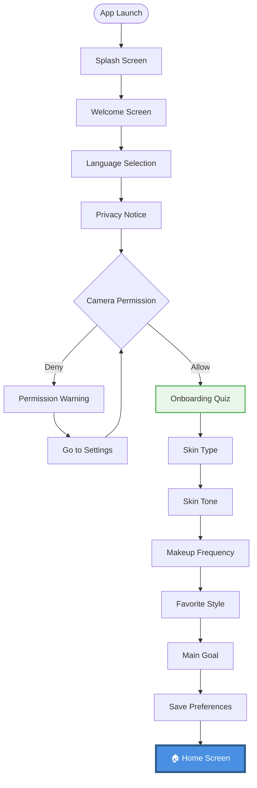
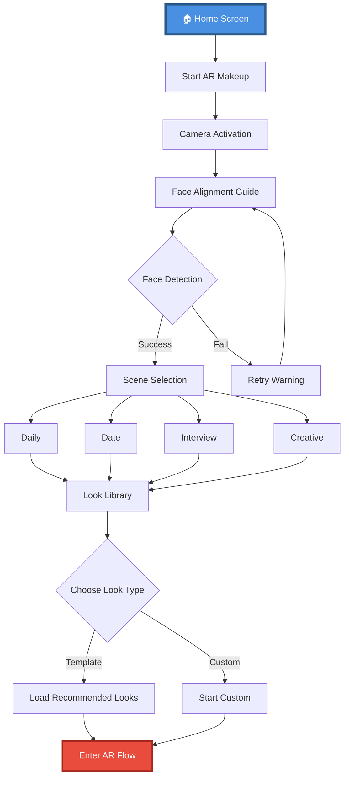
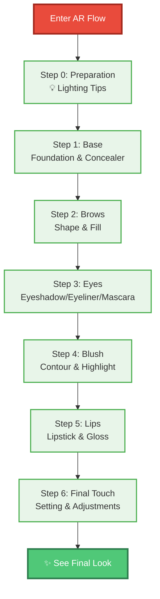
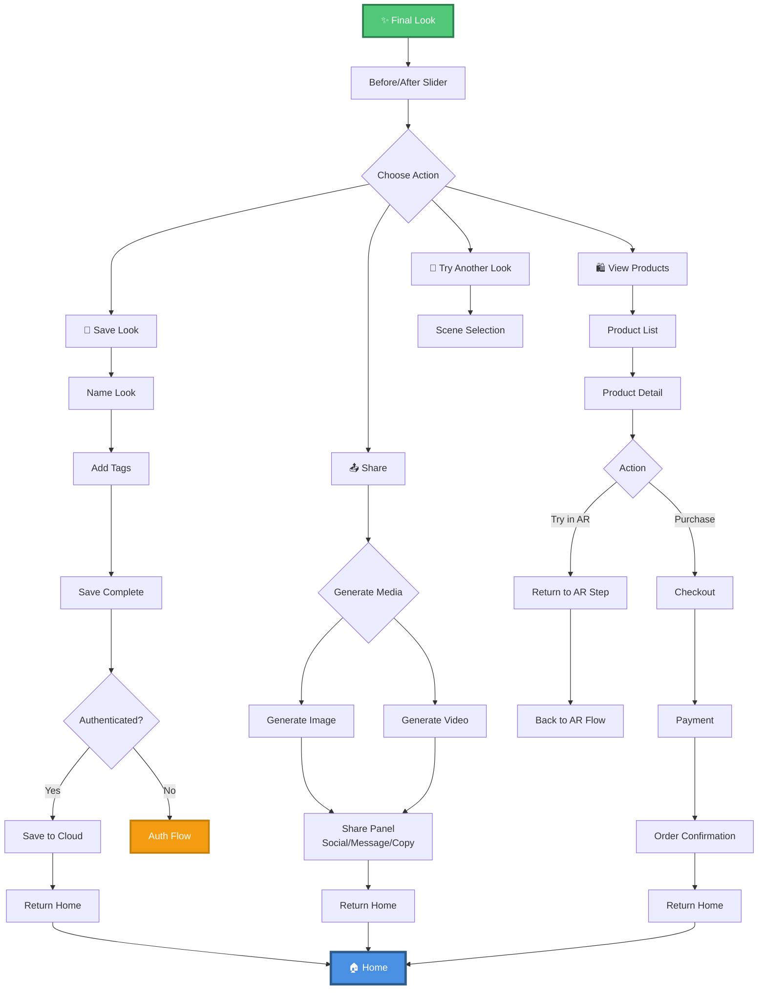
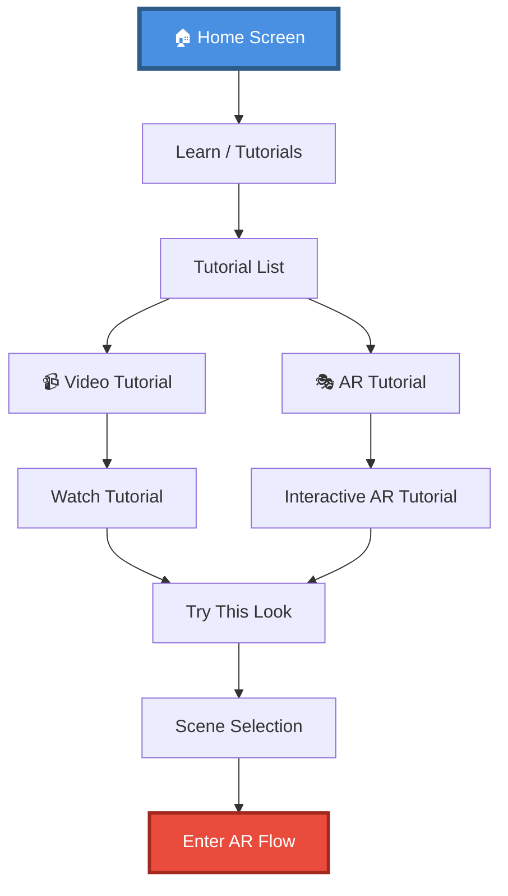
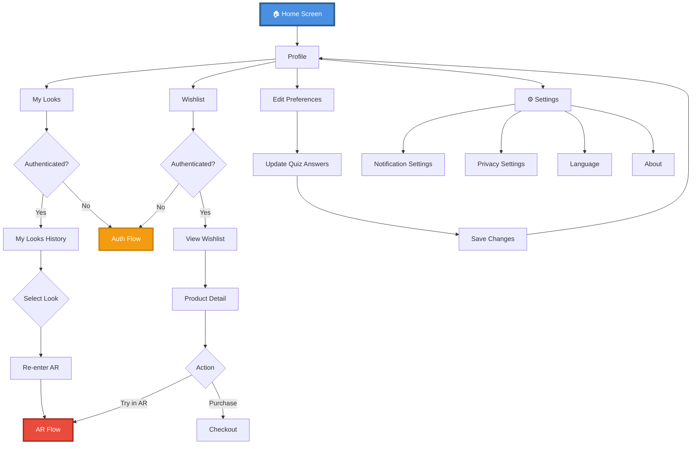
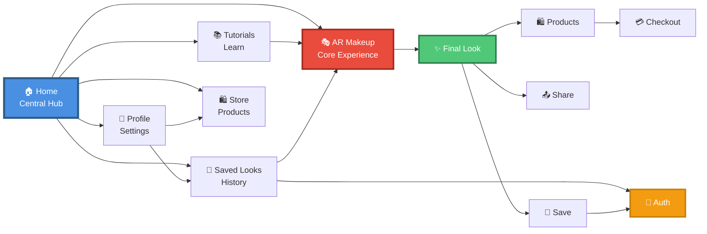

# AR Interactive Makeup App - User Flow Diagram

## Complete User Flow

```mermaid
flowchart TD
    Start([App Launch]) --> Splash[Splash Screen]
    Splash --> Welcome[Welcome Screen]
    Welcome --> Lang[Language Selection]
    Lang --> Privacy[Privacy Notice]
    Privacy --> CamPerm{Camera Permission}

    CamPerm -->|Allow| Quiz[Onboarding Quiz]
    CamPerm -->|Deny| PermWarn[Permission Warning]
    PermWarn --> Settings[Go to Settings]
    Settings --> CamPerm

    Quiz --> Q1[Question 1: Skin Type]
    Q1 --> Q2[Question 2: Skin Tone]
    Q2 --> Q3[Question 3: Makeup Frequency]
    Q3 --> Q4[Question 4: Favorite Style]
    Q4 --> Q5[Question 5: Main Goal]
    Q5 --> SavePref[Save Preferences]
    SavePref --> Home

    Home[🏠 Home Screen] --> |Main CTA| ARStart[Start AR Makeup]
    Home --> Recommended[Recommended Looks]
    Home --> Tutorials[Learn / Tutorials]
    Home --> SavedLooks[Saved Looks]
    Home --> Store[Store]
    Home --> Profile[Profile]

    ARStart --> CamActivate[Camera Activation]
    CamActivate --> FaceGuide[Face Alignment Guide]
    FaceGuide --> FaceDetect{Face Detection}

    FaceDetect -->|Success| SceneSelect[Scene Selection]
    FaceDetect -->|Fail| RetryWarn[Retry Warning]
    RetryWarn --> FaceGuide

    SceneSelect --> Daily[Daily Scene]
    SceneSelect --> Date[Date Scene]
    SceneSelect --> Interview[Interview Scene]
    SceneSelect --> Creative[Creative Scene]

    Daily --> LookLib[Look Library]
    Date --> LookLib
    Interview --> LookLib
    Creative --> LookLib

    LookLib --> |Choose Template| LoadTemplate[Load Recommended Looks]
    LookLib --> |Choose Custom| CustomStart[Start Custom]

    LoadTemplate --> ARFlow[Enter AR Flow]
    CustomStart --> ARFlow

    ARFlow --> Step0[Step 0: Preparation<br/>Lighting Tips]
    Step0 --> Step1[Step 1: Base<br/>Foundation & Concealer]
    Step1 --> Step2[Step 2: Brows<br/>Shape & Fill]
    Step2 --> Step3[Step 3: Eyes<br/>Eyeshadow/Eyeliner/Mascara]
    Step3 --> Step4[Step 4: Blush<br/>Contour & Highlight]
    Step4 --> Step5[Step 5: Lips<br/>Lipstick & Gloss]
    Step5 --> Step6[Step 6: Final Touch<br/>Setting & Adjustments]
    Step6 --> FinalPreview[See Final Look]

    FinalPreview --> BeforeAfter[Before/After Slider]
    BeforeAfter --> FinalActions{Choose Action}

    FinalActions --> SaveLook[💾 Save Look]
    FinalActions --> ShareLook[📤 Share]
    FinalActions --> ViewProducts[🛍️ View Products]
    FinalActions --> TryAnother[🔄 Try Another Look]

    SaveLook --> SaveFlow[Save Look Flow]
    SaveFlow --> NameLook[Name Look]
    NameLook --> AddTags[Add Tags]
    AddTags --> SaveComplete[Save Complete]
    SaveComplete --> CheckAuth{Authenticated?}

    CheckAuth -->|Yes| SaveCloud[Save to Cloud]
    CheckAuth -->|No| AuthFlow[Auth Flow]

    SaveCloud --> ReturnHome1[Return to Home]

    ShareLook --> ShareFlow[Share Flow]
    ShareFlow --> GenMedia{Generate Media}
    GenMedia --> ShareImage[Generate Image]
    GenMedia --> ShareVideo[Generate Video]

    ShareImage --> SharePanel[Share Panel<br/>Social/Message/Copy]
    ShareVideo --> SharePanel
    SharePanel --> ReturnHome2[Return to Home]

    ViewProducts --> ProductList[Product List]
    ProductList --> ProductDetail[Product Detail]
    ProductDetail --> |Try in AR| BackToStep[Return to AR Step]
    ProductDetail --> |Purchase| Checkout[Checkout]

    BackToStep --> ARFlow
    Checkout --> Payment[Payment]
    Payment --> OrderConfirm[Order Confirmation]
    OrderConfirm --> ReturnHome3[Return to Home]

    TryAnother --> SceneSelect

    Recommended --> LookLib
    SavedLooks --> CheckAuth2{Authenticated?}
    CheckAuth2 -->|Yes| MyLooksHistory[My Looks History]
    CheckAuth2 -->|No| AuthFlow

    MyLooksHistory --> SelectSaved{Select Look}
    SelectSaved --> ReenterAR[Re-enter AR]
    ReenterAR --> ARFlow

    Tutorials --> TutorialList[Tutorial List]
    TutorialList --> VideoTut[📹 Video Tutorial]
    TutorialList --> ARTut[🎭 AR Tutorial]

    VideoTut --> TryLook[Try This Look]
    ARTut --> TryLook
    TryLook --> SceneSelect

    Store --> ProductList

    Profile --> EditPrefs[Edit Preferences]
    Profile --> MyLooks[My Looks]
    Profile --> Wishlist[Wishlist]
    Profile --> SettingsMenu[⚙️ Settings]

    MyLooks --> MyLooksHistory
    Wishlist --> CheckAuth3{Authenticated?}
    CheckAuth3 -->|Yes| WishlistView[View Wishlist]
    CheckAuth3 -->|No| AuthFlow

    WishlistView --> ProductDetail

    AuthFlow --> Login[🔑 Login]
    AuthFlow --> Register[📝 Register]
    AuthFlow --> Guest[👤 Continue as Guest]

    Login --> AuthSuccess{Auth Success?}
    Register --> AuthSuccess
    Guest --> GuestMode[Guest Mode Active]

    AuthSuccess -->|Yes| ReturnToPrevious[Return to Previous Screen]
    AuthSuccess -->|No| AuthError[Auth Error]
    AuthError --> AuthFlow

    GuestMode --> ReturnToPrevious

    ReturnHome1 --> Home
    ReturnHome2 --> Home
    ReturnHome3 --> Home
    ReturnToPrevious --> Home

    CamActivate -.->|Camera Disabled| ErrCamDisabled[❌ Camera Disabled Error]
    ErrCamDisabled --> OpenSettings[Open Settings]
    OpenSettings --> CamActivate

    Step0 -.->|Low Light| ErrLowLight[⚠️ Low Light Warning]
    ErrLowLight --> AdjustLight[Adjust Lighting]
    AdjustLight --> Step0

    Home -.->|Network Issue| ErrNetwork[❌ Network Error]
    ErrNetwork --> LoadCached[Load Cached Data]
    LoadCached --> Home

    SaveComplete -.->|Save Failed| ErrSaveFail[❌ Save Failed]
    ErrSaveFail --> RetrySave{Retry?}
    RetrySave -->|Yes| SaveComplete
    RetrySave -->|No| SaveLocal[Save Locally]
    SaveLocal --> ReturnHome1

    style Home fill:#4A90E2,stroke:#2E5C8A,stroke-width:4px,color:#fff
    style ARFlow fill:#E94B3C,stroke:#A3291E,stroke-width:3px,color:#fff
    style FinalPreview fill:#50C878,stroke:#2E7D4E,stroke-width:3px,color:#fff
    style AuthFlow fill:#F39C12,stroke:#C87F0A,stroke-width:3px,color:#fff

    style Step0 fill:#E8F5E9,stroke:#4CAF50,stroke-width:2px
    style Step1 fill:#E8F5E9,stroke:#4CAF50,stroke-width:2px
    style Step2 fill:#E8F5E9,stroke:#4CAF50,stroke-width:2px
    style Step3 fill:#E8F5E9,stroke:#4CAF50,stroke-width:2px
    style Step4 fill:#E8F5E9,stroke:#4CAF50,stroke-width:2px
    style Step5 fill:#E8F5E9,stroke:#4CAF50,stroke-width:2px
    style Step6 fill:#E8F5E9,stroke:#4CAF50,stroke-width:2px

    style ErrCamDisabled fill:#FFEBEE,stroke:#F44336,stroke-width:2px
    style ErrLowLight fill:#FFF3E0,stroke:#FF9800,stroke-width:2px
    style ErrNetwork fill:#FFEBEE,stroke:#F44336,stroke-width:2px
    style ErrSaveFail fill:#FFEBEE,stroke:#F44336,stroke-width:2px
```

## Simplified Sections

### Section 1: Onboarding Flow

### Section 2: AR Core Flow

### Section 3: Step-by-Step AR Makeup Flow

### Section 4: Final Look & Actions

### Section 5: Tutorials & Learning Flow

### Section 6: Profile & Settings Flow

### Section 7: Authentication Flow

```mermaid
flowchart TD
    A[Auth Trigger] --> B{User Action}

    B --> C[🔑 Login]
    B --> D[📝 Register]
    B --> E[👤 Continue as Guest]

    C --> C1[Enter Email/Phone]
    C1 --> C2[Enter Password]
    C2 --> C3{Login Success?}

    D --> D1[Enter Email/Phone]
    D1 --> D2[Create Password]
    D2 --> D3[Confirm Password]
    D3 --> D4[Accept Terms]
    D4 --> D5{Register Success?}

    C3 -->|Yes| SUCCESS[Authentication Success]
    C3 -->|No| ERR1[Login Error]
    ERR1 --> C

    D5 -->|Yes| SUCCESS
    D5 -->|No| ERR2[Registration Error]
    ERR2 --> D

    E --> GUEST[Guest Mode Active<br/>Limited Features]
    GUEST --> SUCCESS

    SUCCESS --> RETURN[Return to Previous Screen]

    style A fill:#F39C12,stroke:#C87F0A,stroke-width:3px,color:#fff
    style SUCCESS fill:#50C878,stroke:#2E7D4E,stroke-width:2px,color:#fff
    style ERR1 fill:#FFEBEE,stroke:#F44336,stroke-width:2px
    style ERR2 fill:#FFEBEE,stroke:#F44336,stroke-width:2px
```

### Section 8: Error Handling

```mermaid
flowchart TD
    subgraph Camera Errors
    A[Camera Activation] -.->|Camera Disabled| A1[❌ Camera Disabled Error]
    A1 --> A2[Open Settings]
    A2 --> A3[Grant Permission]
    A3 --> A
    end

    subgraph Lighting Errors
    B[AR Makeup Steps] -.->|Low Light Detected| B1[⚠️ Low Light Warning]
    B1 --> B2[Adjust Lighting Tips]
    B2 --> B3{Lighting OK?}
    B3 -->|Yes| B
    B3 -->|No| B4[Continue Anyway]
    B4 --> B
    end

    subgraph Network Errors
    C[Load Content] -.->|No Connection| C1[❌ Network Error]
    C1 --> C2{Cached Data Available?}
    C2 -->|Yes| C3[Load Cached Data]
    C2 -->|No| C4[Retry Connection]
    C3 --> C5[Show Offline Banner]
    C4 --> C
    end

    subgraph Save Errors
    D[Save Look] -.->|Save Failed| D1[❌ Save Failed]
    D1 --> D2{Choose Option}
    D2 -->|Retry| D
    D2 -->|Save Locally| D3[Save to Device Only]
    D3 --> D4[Sync When Online]
    end

    style A1 fill:#FFEBEE,stroke:#F44336,stroke-width:2px
    style B1 fill:#FFF3E0,stroke:#FF9800,stroke-width:2px
    style C1 fill:#FFEBEE,stroke:#F44336,stroke-width:2px
    style D1 fill:#FFEBEE,stroke:#F44336,stroke-width:2px
```

## Navigation Map

---

## 📋 Flow Summary

### Core User Journeys

1. **First-Time User Journey**
   - Launch → Onboarding → Quiz → Home → AR Experience

2. **Quick Makeup Journey**
   - Home → AR → Scene → Template → Steps → Final → Save/Share

3. **Learning Journey**
   - Home → Tutorials → Watch → Try Look → AR → Complete

4. **Shopping Journey**
   - Home → Store → Product → Try AR → Purchase → Checkout

5. **Returning User Journey**
   - Home → Saved Looks → Select → Re-enter AR → Modify → Save

### Key Decision Points

- **Camera Permission**: Critical for core functionality
- **Authentication**: Required for cloud save, wishlist, purchases
- **Face Detection**: Gates entry into AR experience
- **Scene Selection**: Personalizes look recommendations
- **Final Actions**: Multiple exit paths (save/share/shop/retry)

### Error Recovery Paths

- Camera disabled → Settings → Permission
- Low light → Tips → Continue/Adjust
- Network error → Cached data → Offline mode
- Save failed → Retry → Local save → Cloud sync later

---

*Generated for UX Design Course Submission*
*Format: Professional User Flow Diagram with Mermaid*
