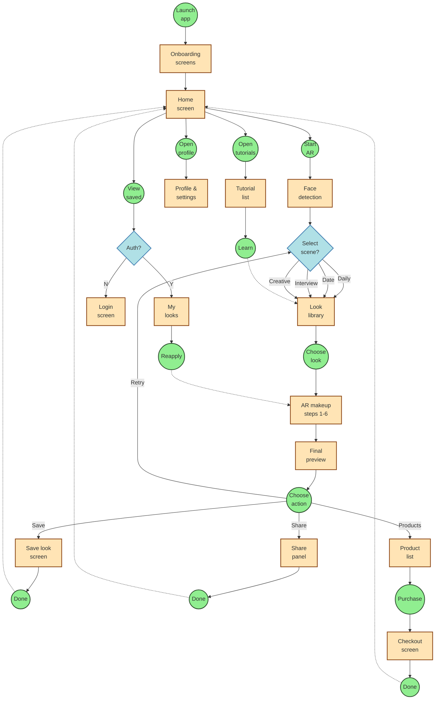
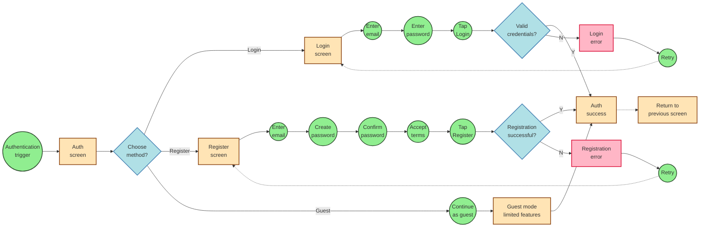
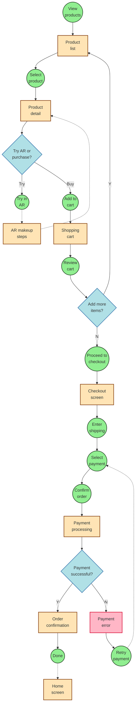
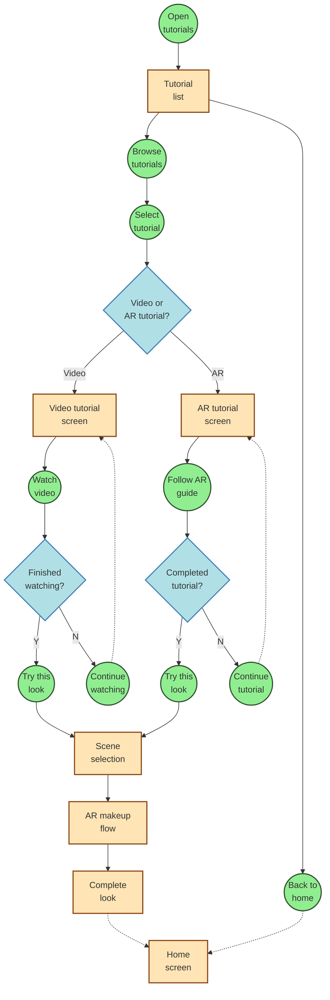
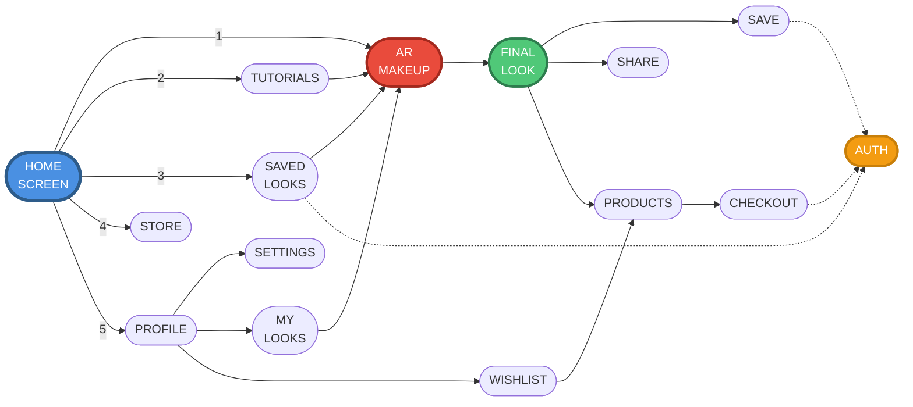

# AR Interactive Makeup App - Professional User Flow

## Design Convention
- **Circles** → Actions users take when moving through the product
- **Rectangles** → Screens of the digital product that users will experience
- **Diamonds** → Decision points where users must ask a question and make a decision
- **Arrows** → Lines that tie everything together and display the flow of information

---

## Complete User Flow Diagram

```mermaid
flowchart TD
    %% ============================================
    %% 0. APP LAUNCH & ONBOARDING FLOW
    %% ============================================

    Start((Open app)) --> Splash[Splash screen]
    Splash --> Welcome[Welcome screen]
    Welcome --> ActGetStarted((Tap Get Started))
    ActGetStarted --> Lang[Language selection]
    Lang --> ActSelectLang((Select language))
    ActSelectLang --> Privacy[Privacy notice]
    Privacy --> ActAcceptPrivacy((Accept privacy))
    ActAcceptPrivacy --> CamPerm{Camera<br/>permission?}

    CamPerm -->|Allow| Quiz[Onboarding quiz]
    CamPerm -->|Deny| PermWarn[Permission warning]
    PermWarn --> ActGoSettings((Go to settings))
    ActGoSettings -.-> CamPerm

    Quiz --> ActAnswerQ1((Answer:<br/>Skin type))
    ActAnswerQ1 --> ActAnswerQ2((Answer:<br/>Skin tone))
    ActAnswerQ2 --> ActAnswerQ3((Answer:<br/>Makeup frequency))
    ActAnswerQ3 --> ActAnswerQ4((Answer:<br/>Favorite style))
    ActAnswerQ4 --> ActAnswerQ5((Answer:<br/>Main goal))
    ActAnswerQ5 --> QuizComplete[Quiz complete]
    QuizComplete --> ActSavePref((Save preferences))
    ActSavePref --> Home[Home screen]

    %% ============================================
    %% 1. HOME SCREEN NAVIGATION
    %% ============================================

    Home --> ActStartAR((Tap Start<br/>AR Makeup))
    Home --> ActViewRecommended((Browse<br/>recommended looks))
    Home --> ActViewTutorials((Open<br/>tutorials))
    Home --> ActViewSaved((Open<br/>saved looks))
    Home --> ActOpenStore((Open<br/>store))
    Home --> ActOpenProfile((Open<br/>profile))

    %% ============================================
    %% 2. AR CORE FLOW - FACE DETECTION
    %% ============================================

    ActStartAR --> CamActivate[Camera activation]
    CamActivate --> FaceGuide[Face alignment guide]
    FaceGuide --> ActAlignFace((Align face<br/>with guide))
    ActAlignFace --> FaceDetect{Face<br/>detected?}

    FaceDetect -->|Y| SceneScreen[Scene selection]
    FaceDetect -->|N| RetryWarn[Retry warning]
    RetryWarn --> ActRetry((Retry detection))
    ActRetry -.-> ActAlignFace

    %% Camera error handling
    CamActivate -.->|Camera disabled| CamError[Camera error screen]
    CamError --> ActOpenSysSettings((Open system<br/>settings))
    ActOpenSysSettings -.-> CamActivate

    %% ============================================
    %% 2. SCENE SELECTION
    %% ============================================

    SceneScreen --> ActSelectDaily((Select<br/>Daily))
    SceneScreen --> ActSelectDate((Select<br/>Date))
    SceneScreen --> ActSelectInterview((Select<br/>Interview))
    SceneScreen --> ActSelectCreative((Select<br/>Creative))

    ActSelectDaily --> LookLib[Look library]
    ActSelectDate --> LookLib
    ActSelectInterview --> LookLib
    ActSelectCreative --> LookLib

    LookLib --> ChooseLookType{Choose<br/>look type?}
    ChooseLookType -->|Template| ActSelectTemplate((Select<br/>template))
    ChooseLookType -->|Custom| ActStartCustom((Start<br/>custom))

    ActSelectTemplate --> ARFlowStart[AR makeup flow]
    ActStartCustom --> ARFlowStart

    %% ============================================
    %% 3. STEP-BY-STEP AR MAKEUP FLOW
    %% ============================================

    ARFlowStart --> Step0[Step 0: Preparation]
    Step0 --> ActReadTips((Read lighting<br/>tips))
    ActReadTips --> CheckLight{Lighting<br/>OK?}

    CheckLight -->|Y| Step1[Step 1: Base]
    CheckLight -->|N| LightWarn[Low light warning]
    LightWarn --> AdjustOrContinue{Adjust or<br/>continue?}
    AdjustOrContinue -->|Adjust| ActAdjustLight((Adjust<br/>lighting))
    AdjustOrContinue -->|Continue| Step1
    ActAdjustLight -.-> CheckLight

    Step1 --> ActApplyBase((Apply foundation<br/>& concealer))
    ActApplyBase --> ActNextStep1((Tap Next))
    ActNextStep1 --> Step2[Step 2: Brows]

    Step2 --> ActApplyBrows((Shape & fill<br/>brows))
    ActApplyBrows --> ActNextStep2((Tap Next))
    ActNextStep2 --> Step3[Step 3: Eyes]

    Step3 --> ActApplyEyes((Apply eyeshadow,<br/>liner, mascara))
    ActApplyEyes --> ActNextStep3((Tap Next))
    ActNextStep3 --> Step4[Step 4: Blush]

    Step4 --> ActApplyBlush((Apply blush,<br/>contour, highlight))
    ActApplyBlush --> ActNextStep4((Tap Next))
    ActNextStep4 --> Step5[Step 5: Lips]

    Step5 --> ActApplyLips((Apply lipstick<br/>& gloss))
    ActApplyLips --> ActNextStep5((Tap Next))
    ActNextStep5 --> Step6[Step 6: Final touch]

    Step6 --> ActFinalAdjust((Make final<br/>adjustments))
    ActFinalAdjust --> ActSeeFinal((Tap See<br/>Final Look))
    ActSeeFinal --> FinalPreview[Final preview]

    %% ============================================
    %% 4. FINAL LOOK ACTIONS
    %% ============================================

    FinalPreview --> BeforeAfter[Before/After slider]
    BeforeAfter --> ActChooseAction((Choose<br/>action))

    ActChooseAction --> ActSaveLook((Tap Save<br/>Look))
    ActChooseAction --> ActShareLook((Tap Share))
    ActChooseAction --> ActViewProducts((Tap View<br/>Products))
    ActChooseAction --> ActTryAnother((Tap Try<br/>Another Look))

    %% Save Flow
    ActSaveLook --> SaveFlow[Save look screen]
    SaveFlow --> ActNameLook((Enter look<br/>name))
    ActNameLook --> ActAddTags((Add tags))
    ActAddTags --> ActConfirmSave((Tap Save))
    ActConfirmSave --> AuthCheck1{Authenticated?}

    AuthCheck1 -->|Y| SaveSuccess[Save successful]
    AuthCheck1 -->|N| AuthScreen[Auth screen]
    SaveSuccess --> Home

    %% Save error handling
    ActConfirmSave -.->|Save failed| SaveError[Save error screen]
    SaveError --> RetrySave{Retry or<br/>save locally?}
    RetrySave -->|Retry| ActConfirmSave
    RetrySave -->|Local| ActSaveLocal((Save to<br/>device))
    ActSaveLocal --> SaveLocalSuccess[Saved locally]
    SaveLocalSuccess -.-> Home

    %% Share Flow
    ActShareLook --> ShareFlow[Share options]
    ShareFlow --> MediaType{Generate<br/>image or video?}

    MediaType -->|Image| ActGenImage((Generate<br/>image))
    MediaType -->|Video| ActGenVideo((Generate<br/>video))

    ActGenImage --> SharePanel[Share panel]
    ActGenVideo --> SharePanel
    SharePanel --> ActShareTo((Share to<br/>platform))
    ActShareTo --> ShareSuccess[Shared successfully]
    ShareSuccess -.-> Home

    %% Try Another Flow
    ActTryAnother -.-> SceneScreen

    %% ============================================
    %% 5. PRODUCT FLOW
    %% ============================================

    ActViewProducts --> ProductList[Product list]
    ActOpenStore --> ProductList

    ProductList --> ActSelectProduct((Select<br/>product))
    ActSelectProduct --> ProductDetail[Product detail]

    ProductDetail --> ProductAction{Try in AR<br/>or purchase?}

    ProductAction -->|Try AR| ActTryProductAR((Tap Try<br/>in AR))
    ProductAction -->|Purchase| ActAddToCart((Add to<br/>cart))

    ActTryProductAR -.-> Step1

    ActAddToCart --> CartScreen[Shopping cart]
    CartScreen --> ActProceedCheckout((Tap Checkout))
    ActProceedCheckout --> CheckoutScreen[Checkout screen]

    CheckoutScreen --> ActEnterShipping((Enter shipping<br/>info))
    ActEnterShipping --> ActSelectPayment((Select payment<br/>method))
    ActSelectPayment --> ActConfirmOrder((Confirm<br/>order))
    ActConfirmOrder --> PaymentProcess[Payment processing]

    PaymentProcess --> PaymentSuccess{Payment<br/>successful?}
    PaymentSuccess -->|Y| OrderConfirm[Order confirmation]
    PaymentSuccess -->|N| PaymentError[Payment error]
    PaymentError --> ActRetryPayment((Retry<br/>payment))
    ActRetryPayment -.-> ActSelectPayment

    OrderConfirm -.-> Home

    %% ============================================
    %% 6. TUTORIALS FLOW
    %% ============================================

    ActViewTutorials --> TutorialList[Tutorial list]
    TutorialList --> ActSelectTutorial((Select<br/>tutorial))
    ActSelectTutorial --> TutorialType{Video or<br/>AR tutorial?}

    TutorialType -->|Video| VideoTutorial[Video tutorial screen]
    TutorialType -->|AR| ARTutorial[AR tutorial screen]

    VideoTutorial --> ActWatchVideo((Watch<br/>video))
    ARTutorial --> ActFollowARTutorial((Follow AR<br/>tutorial))

    ActWatchVideo --> ActTryThisLook((Tap Try<br/>This Look))
    ActFollowARTutorial --> ActTryThisLook

    ActTryThisLook -.-> SceneScreen

    %% ============================================
    %% 7. SAVED LOOKS & PROFILE
    %% ============================================

    ActViewSaved --> AuthCheck2{Authenticated?}
    AuthCheck2 -->|Y| MySavedLooks[My saved looks]
    AuthCheck2 -->|N| AuthScreen

    MySavedLooks --> ActSelectSavedLook((Select<br/>saved look))
    ActSelectSavedLook --> SavedLookDetail[Saved look detail]
    SavedLookDetail --> ActReapplyLook((Tap Reapply<br/>Look))
    ActReapplyLook -.-> ARFlowStart

    %% Profile Flow
    ActOpenProfile --> ProfileScreen[Profile screen]
    ProfileScreen --> ActEditPrefs((Edit<br/>preferences))
    ProfileScreen --> ActViewMyLooks((View My<br/>Looks))
    ProfileScreen --> ActViewWishlist((View<br/>Wishlist))
    ProfileScreen --> ActOpenSettings((Open<br/>Settings))

    ActEditPrefs --> PrefsScreen[Preferences screen]
    PrefsScreen --> ActUpdateQuiz((Update quiz<br/>answers))
    ActUpdateQuiz --> ActSavePrefs((Save<br/>changes))
    ActSavePrefs -.-> ProfileScreen

    ActViewMyLooks --> MySavedLooks

    ActViewWishlist --> AuthCheck3{Authenticated?}
    AuthCheck3 -->|Y| WishlistScreen[Wishlist screen]
    AuthCheck3 -->|N| AuthScreen

    WishlistScreen --> ActSelectWishlistItem((Select<br/>item))
    ActSelectWishlistItem --> ProductDetail

    ActOpenSettings --> SettingsScreen[Settings screen]
    SettingsScreen --> ActChangeSettings((Adjust<br/>settings))
    ActChangeSettings -.-> ProfileScreen

    %% ============================================
    %% 8. AUTHENTICATION FLOW
    %% ============================================

    AuthScreen --> AuthChoice{Login, register,<br/>or guest?}

    AuthChoice -->|Login| LoginScreen[Login screen]
    AuthChoice -->|Register| RegisterScreen[Register screen]
    AuthChoice -->|Guest| ActContinueGuest((Continue as<br/>guest))

    LoginScreen --> ActEnterLoginEmail((Enter email/<br/>phone))
    ActEnterLoginEmail --> ActEnterPassword((Enter<br/>password))
    ActEnterPassword --> ActTapLogin((Tap Login))
    ActTapLogin --> LoginProcess{Login<br/>successful?}

    LoginProcess -->|Y| AuthSuccess[Authentication success]
    LoginProcess -->|N| LoginError[Login error]
    LoginError --> ActRetryLogin((Retry<br/>login))
    ActRetryLogin -.-> LoginScreen

    RegisterScreen --> ActEnterRegEmail((Enter email/<br/>phone))
    ActEnterRegEmail --> ActCreatePassword((Create<br/>password))
    ActCreatePassword --> ActConfirmPassword((Confirm<br/>password))
    ActConfirmPassword --> ActAcceptTerms((Accept<br/>terms))
    ActAcceptTerms --> ActTapRegister((Tap Register))
    ActTapRegister --> RegisterProcess{Registration<br/>successful?}

    RegisterProcess -->|Y| AuthSuccess
    RegisterProcess -->|N| RegisterError[Registration error]
    RegisterError --> ActRetryRegister((Retry<br/>registration))
    ActRetryRegister -.-> RegisterScreen

    ActContinueGuest --> GuestMode[Guest mode active]
    GuestMode --> AuthSuccess

    AuthSuccess -.-> Home

    %% ============================================
    %% 9. RECOMMENDED LOOKS FLOW
    %% ============================================

    ActViewRecommended --> RecommendedScreen[Recommended looks]
    RecommendedScreen --> ActSelectRecommended((Select<br/>look))
    ActSelectRecommended -.-> LookLib

    %% ============================================
    %% ERROR HANDLING - NETWORK
    %% ============================================

    Home -.->|No connection| NetworkError[Network error]
    NetworkError --> CachedAvailable{Cached data<br/>available?}
    CachedAvailable -->|Y| ActLoadCached((Load cached<br/>data))
    CachedAvailable -->|N| ActRetryConnection((Retry<br/>connection))
    ActLoadCached --> OfflineMode[Offline mode]
    OfflineMode -.-> Home
    ActRetryConnection -.-> Home

    %% ============================================
    %% STYLING
    %% ============================================

    classDef actionStyle fill:#90EE90,stroke:#2F4F2F,stroke-width:2px
    classDef screenStyle fill:#FFE4B5,stroke:#8B4513,stroke-width:2px
    classDef decisionStyle fill:#B0E0E6,stroke:#4682B4,stroke-width:2px
    classDef errorStyle fill:#FFB6C6,stroke:#DC143C,stroke-width:2px
    classDef successStyle fill:#98FB98,stroke:#228B22,stroke-width:2px

    %% Apply action style to all circles
    class Start,ActGetStarted,ActSelectLang,ActAcceptPrivacy,ActGoSettings,ActAnswerQ1,ActAnswerQ2,ActAnswerQ3,ActAnswerQ4,ActAnswerQ5,ActSavePref actionStyle
    class ActStartAR,ActViewRecommended,ActViewTutorials,ActViewSaved,ActOpenStore,ActOpenProfile actionStyle
    class ActAlignFace,ActRetry,ActOpenSysSettings,ActSelectDaily,ActSelectDate,ActSelectInterview,ActSelectCreative actionStyle
    class ActSelectTemplate,ActStartCustom,ActReadTips,ActAdjustLight,ActApplyBase,ActNextStep1,ActApplyBrows,ActNextStep2 actionStyle
    class ActApplyEyes,ActNextStep3,ActApplyBlush,ActNextStep4,ActApplyLips,ActNextStep5,ActFinalAdjust,ActSeeFinal actionStyle
    class ActChooseAction,ActSaveLook,ActShareLook,ActViewProducts,ActTryAnother,ActNameLook,ActAddTags,ActConfirmSave actionStyle
    class ActSaveLocal,ActGenImage,ActGenVideo,ActShareTo,ActSelectProduct,ActTryProductAR,ActAddToCart actionStyle
    class ActProceedCheckout,ActEnterShipping,ActSelectPayment,ActConfirmOrder,ActRetryPayment,ActSelectTutorial actionStyle
    class ActWatchVideo,ActFollowARTutorial,ActTryThisLook,ActSelectSavedLook,ActReapplyLook,ActEditPrefs actionStyle
    class ActViewMyLooks,ActViewWishlist,ActOpenSettings,ActUpdateQuiz,ActSavePrefs,ActSelectWishlistItem actionStyle
    class ActChangeSettings,ActContinueGuest,ActEnterLoginEmail,ActEnterPassword,ActTapLogin,ActRetryLogin actionStyle
    class ActEnterRegEmail,ActCreatePassword,ActConfirmPassword,ActAcceptTerms,ActTapRegister,ActRetryRegister actionStyle
    class ActSelectRecommended,ActLoadCached,ActRetryConnection actionStyle

    %% Apply screen style to all rectangles
    class Splash,Welcome,Lang,Privacy,PermWarn,Quiz,QuizComplete,Home,CamActivate,FaceGuide,RetryWarn screenStyle
    class SceneScreen,LookLib,ARFlowStart,Step0,LightWarn,Step1,Step2,Step3,Step4,Step5,Step6 screenStyle
    class FinalPreview,BeforeAfter,SaveFlow,SaveSuccess,SaveLocalSuccess,ShareFlow,SharePanel,ShareSuccess screenStyle
    class ProductList,ProductDetail,CartScreen,CheckoutScreen,PaymentProcess,OrderConfirm,TutorialList screenStyle
    class VideoTutorial,ARTutorial,MySavedLooks,SavedLookDetail,ProfileScreen,PrefsScreen,WishlistScreen screenStyle
    class SettingsScreen,AuthScreen,LoginScreen,RegisterScreen,GuestMode,AuthSuccess,RecommendedScreen,OfflineMode screenStyle

    %% Apply decision style to all diamonds
    class CamPerm,FaceDetect,ChooseLookType,CheckLight,AdjustOrContinue,AuthCheck1,RetrySave,MediaType decisionStyle
    class ProductAction,PaymentSuccess,TutorialType,AuthCheck2,AuthCheck3,AuthChoice,LoginProcess,RegisterProcess decisionStyle
    class CachedAvailable decisionStyle

    %% Apply error style
    class CamError,SaveError,PaymentError,LoginError,RegisterError,NetworkError errorStyle
```



---

## Simplified Core Journey Map



---

## Feature-Specific Flows

### Flow 1: Authentication Journey



### Flow 2: Product Purchase Journey



### Flow 3: Tutorial & Learning Journey



### Flow 4: Error Handling Scenarios

```mermaid
flowchart TD
    subgraph Camera ["Camera Permission Error"]
    A1[Camera<br/>activation] -.->|Permission denied| A2[Permission<br/>error]
    A2 --> A3((Open<br/>settings))
    A3 -.-> A4[System<br/>settings]
    A4 --> A5((Grant<br/>permission))
    A5 -.-> A1
    end

    subgraph Light ["Low Light Warning"]
    B1[AR makeup<br/>step] -.->|Light < threshold| B2[Low light<br/>warning]
    B2 --> B3{Adjust or<br/>continue?}
    B3 -->|Adjust| B4((Adjust<br/>lighting))
    B3 -->|Continue| B5((Continue<br/>anyway))
    B4 -.-> B1
    B5 --> B1
    end

    subgraph Network ["Network Error"]
    C1[Load<br/>content] -.->|No connection| C2[Network<br/>error]
    C2 --> C3{Cached data<br/>available?}
    C3 -->|Y| C4((Load<br/>cached))
    C3 -->|N| C5((Retry<br/>connection))
    C4 --> C6[Offline<br/>mode]
    C5 -.-> C1
    C6 --> C7[Limited<br/>features]
    end

    subgraph Save ["Save Error"]
    D1((Save<br/>look)) -.->|Save failed| D2[Save<br/>error]
    D2 --> D3{Retry or<br/>save locally?}
    D3 -->|Retry| D4((Retry<br/>save))
    D3 -->|Local| D5((Save to<br/>device))
    D4 -.-> D1
    D5 --> D6[Saved<br/>locally]
    D6 --> D7[Sync when<br/>online]
    end

    classDef actionStyle fill:#90EE90,stroke:#2F4F2F,stroke-width:2px
    classDef screenStyle fill:#FFE4B5,stroke:#8B4513,stroke-width:2px
    classDef decisionStyle fill:#B0E0E6,stroke:#4682B4,stroke-width:2px
    classDef errorStyle fill:#FFB6C6,stroke:#DC143C,stroke-width:2px

    class A3,A5,B4,B5,C4,C5,D1,D4,D5 actionStyle
    class A1,A4,B1,C1,C6,C7,D6,D7 screenStyle
    class B3,C3,D3 decisionStyle
    class A2,B2,C2,D2 errorStyle
```



---

## Quick Reference: Navigation Map



---

## Design System Legend

| Shape | Meaning | Color | Example |
|-------|---------|-------|---------|
| ⭕ Circle | **User Action** | Green | `((Tap button))` |
| 📄 Rectangle | **Screen** | Orange | `[Home screen]` |
| 💎 Diamond | **Decision Point** | Blue | `{Login or register?}` |
| ➡️ Solid Arrow | **Primary Flow** | Black | Main path |
| ⤵️ Dotted Arrow | **Return/Optional** | Gray | Back navigation |
| ❌ Error Shape | **Error State** | Red | Error screens |

---

## Core User Journeys Summary

### 1️⃣ First-Time User (Complete Onboarding)
```
Open app → Splash → Welcome → Language → Privacy → Camera permission →
Onboarding quiz (5 questions) → Save preferences → Home screen
```

### 2️⃣ Quick Makeup (Returning User)
```
Home → Start AR → Face detection → Scene selection → Choose template →
AR steps (0-6) → Final preview → Save/Share → Home
```

### 3️⃣ Learning Journey
```
Home → Tutorials → Select tutorial → Watch/Follow → Try this look →
Scene selection → AR flow → Complete → Home
```

### 4️⃣ Shopping Journey
```
Home → Store → Select product → Try in AR or Add to cart →
Checkout → Payment → Order confirmation → Home
```

### 5️⃣ Revisit Saved Look
```
Home → Saved looks → Auth check → My looks → Select →
Reapply → AR flow → Modify → Save → Home
```

---

**Document Type:** Professional UX User Flow Diagram
**Format:** Mermaid with Standard UX Conventions
**Suitable for:** Design Portfolio | Course Submission | Development Reference
